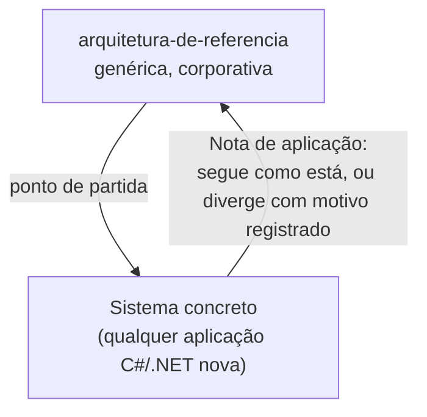
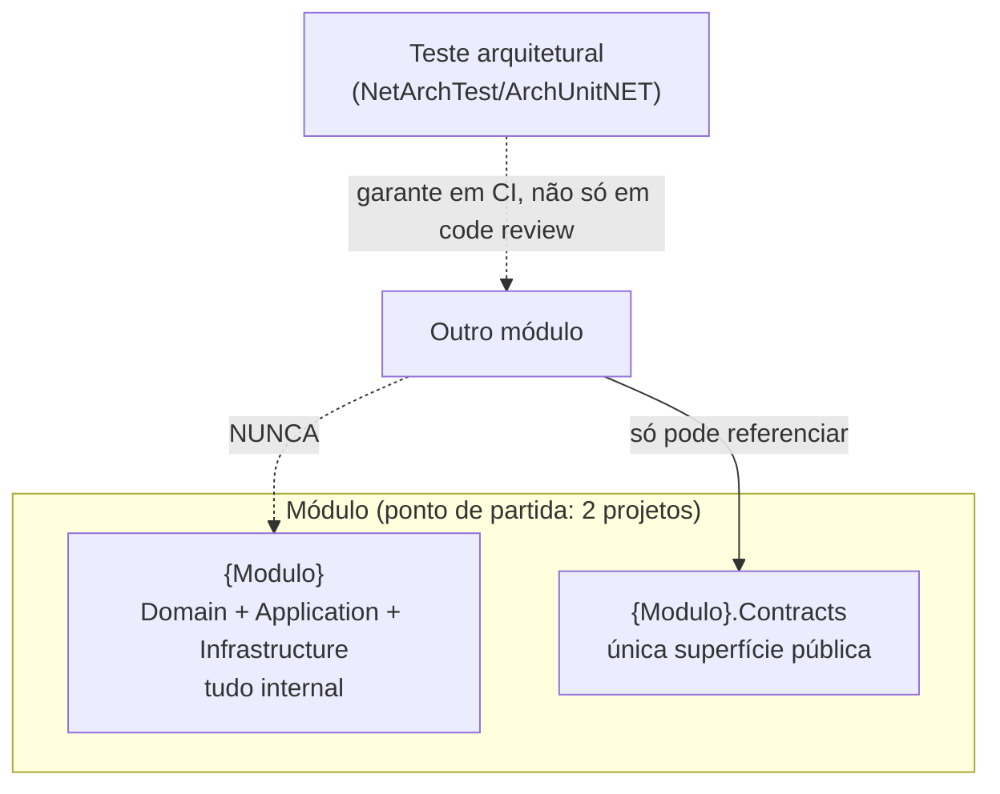
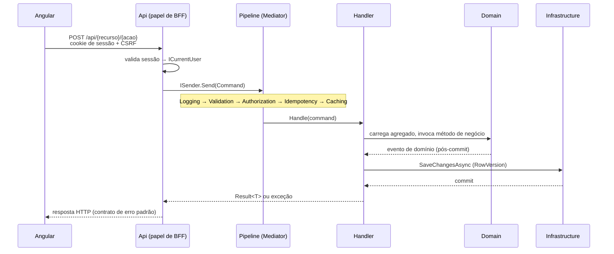
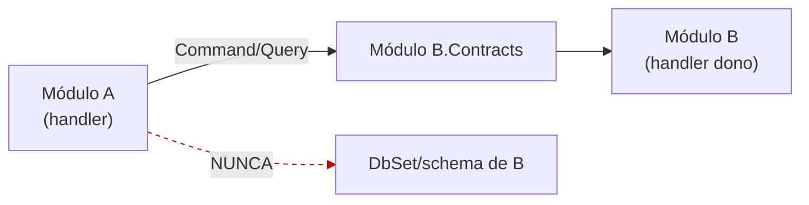
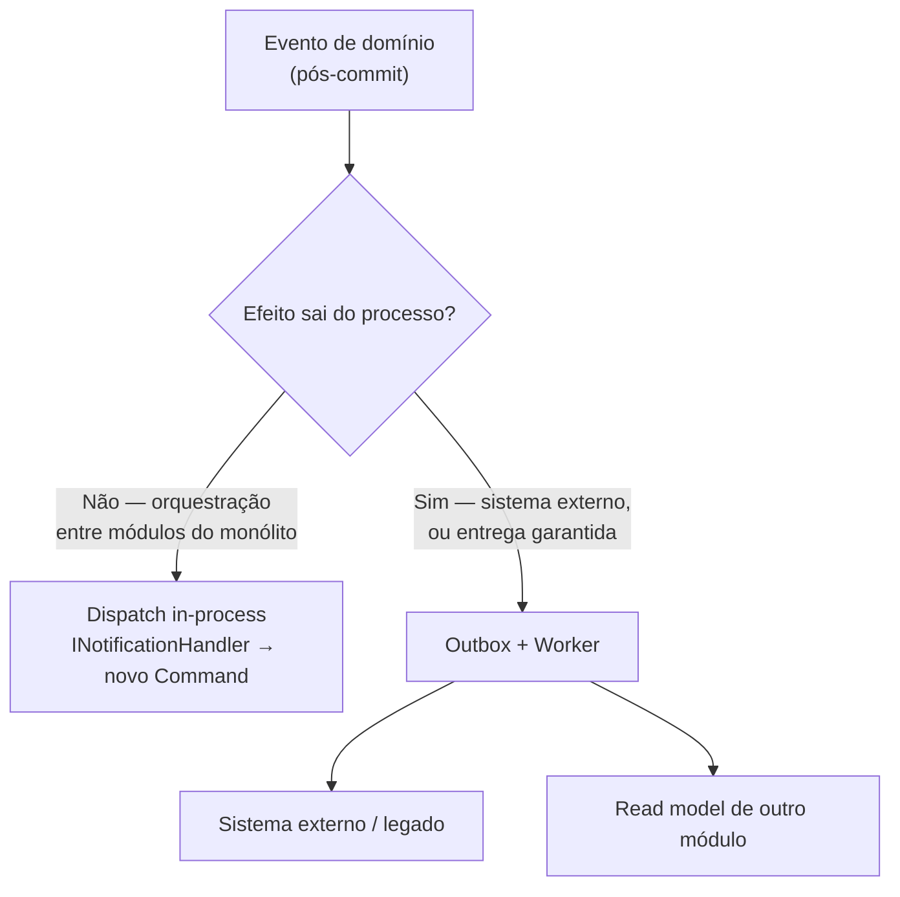
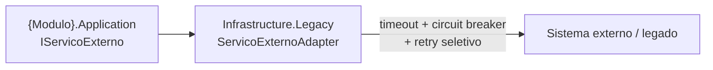

# Arquitetura de referência corporativa

> Visão geral para apresentação. Detalhe completo, racional e trade-offs de cada decisão estão nos 29 documentos numerados desta pasta. Este documento resume e ilustra, não substitui nenhum deles.

## O que é isto, e o que não é

Um conjunto de recomendações arquiteturais **genéricas**, para qualquer sistema C#/.NET novo que adote monólito modular + DDD tático + CQRS. Não é a especificação de um sistema específico, mas o ponto de partida que um sistema concreto adota como está, ou do qual diverge conscientemente, registrando o motivo.

Esse registro vive numa seção **"Nota de aplicação"** em cada um dos 29 documentos, para distinguir divergência registrada de inconsistência não percebida.

## Monólito modular

Cada módulo é um bounded context completo: dado próprio, agregado próprio, só acessado de fora pelo que expõe explicitamente. `Contracts` é essa fronteira pública, e ela não muda quando o módulo cresce por dentro (ver promoção de estrutura, abaixo) — só o que fica atrás dela muda de tamanho.

Promoção para estrutura completa (`Domain`/`Application`/`Infrastructure`/`Contracts` separados) só quando pelo menos dois sinais objetivos aparecerem: múltiplos agregados complexos, volume de casos de uso, candidato real a extração, mais de um time no módulo. Sem isso, o ponto de partida enxuto é o mais seguro.

## Domínio

Domínio é rico onde importa, anêmico onde é só dado: decisão por entidade, não pela solution inteira. Autorização nunca mora no agregado. Teste rápido: _a regra continuaria valendo se disparada por um processo automatizado, sem usuário logado?_ Se sim, é invariante de domínio. Se não, é permissão, e mora fora do agregado.

## Fluxo de uma requisição, do Angular ao banco

Um behavior novo entra na posição que a natureza dele exige: efeito colateral observável (log, cache) fica nas pontas; o que pode interromper o fluxo (validação, autorização, idempotência) fica antes do handler, na ordem em que uma rejeição mais barata evita o custo de calcular uma mais cara.

## Comunicação entre módulos

Um módulo nunca acessa o schema alheio.

| Cenário | Mecanismo |
| --- | --- |
| Leitura pontual de um módulo alheio | `Query` do `Contracts` daquele módulo |
| Poucos módulos, baixo volume, mesma tela | Composição na borda (BFF/Api), nunca inline no controller |
| Composição se repete, ou volume alto | Read model dedicado, projeção assíncrona via Outbox |
| Consulta direta a mais de um schema | Exceção restrita, exige aprovação explícita em revisão de arquitetura |

## Processamento assíncrono

São dois mecanismos, não um.

Outbox custa tabela extra, processo de publicação e monitoramento. Só se justifica quando o efeito cruza a fronteira do processo ou quando "melhor esforço, loga e segue" deixa de ser aceitável.

## Autenticação

```mermaid
graph LR
    IdP["IdP<br/>(qualquer protocolo)"] --> Token["Token/assertion<br/>validada"]
    Token --> ExtId["Identidade<br/>externa"]
    ExtId --> IntId["Identidade interna<br/>(UserId canônico)"]
    IntId --> Sessao["Sessão<br/>server-side"]
    Sessao --> Cookie["Cookie<br/>HttpOnly/Secure"]
    Cookie --> Claims["ClaimsPrincipal"]
    Claims --> CU["ICurrentUser"]
    CU --> AuthZ["Authorization"]
    AuthZ --> App["Application / Domain"]
```

O backend é a fronteira de confiança, nunca o browser: token nunca vive no frontend, Angular recebe só cookie de sessão. A camada de mapeamento de identidade externa é o que permite trocar o protocolo do IdP sem alterar o resto do sistema.

## Integração com sistema externo/legado

Toda integração externa passa por uma Anti-Corruption Layer, e todo adapter é resiliente por padrão, não por exceção. Num monólito, todos os módulos compartilham o mesmo pool de threads, e uma chamada lenta sem proteção degrada módulos completamente não relacionados.

## Autorização por recurso

Duas leituras, dois lugares:

| Leitura | Exemplo | Mecanismo | Onde vive |
| --- | --- | --- | --- |
| Papel genérico | "Só usuário com papel X" | `[Authorize(Roles = "...")]` | Api, nativo do framework |
| Dependente de dado | "Só o dono deste recurso" | `IRequiresAuthorization` + `AuthorizationBehavior` | Application, pipeline behavior |

## Índice dos 29 documentos

| # | Documento | Assunto |
| --- | --- | --- |
| 01 | Estrutura de projetos | Quantos projetos por módulo, fronteira fixa |
| 02 | Domínio híbrido | Rico vs. anêmico, fronteira de agregado |
| 03 | Commands e Queries | Mediator/CQRS, ordem de pipeline |
| 04 | Comunicação entre módulos | Leitura/escrita, Contracts, composição na borda |
| 05 | Processamento assíncrono | Dispatch in-process vs. Outbox |
| 06 | Contrato de erro HTTP | `Result.Failure`, idempotência, concorrência, RFC 9457 e `errors[]` |
| 07 | Integração legado/ACL | Anti-Corruption Layer, resiliência |
| 08 | Convenção de nomenclatura | Língua de domínio vs. termo técnico |
| 09 | Convenções REST | Rota, verbo, `Idempotency-Key` |
| 10 | Configuração e segredos | `IOptions<T>`, segredo nunca versionado |
| 11 | Autenticação e sessão | BFF, identidade interna, `ICurrentUser` |
| 12 | Autorização por recurso | `IRequiresAuthorization` |
| 13 | Estratégia de testes | Projeto de teste por camada/módulo |
| 14 | Filtro de dados | Por linha e por campo |
| 15 | Observabilidade | Correlação, log estruturado, OpenTelemetry |
| 16 | Validação sintática vs. invariante | Três categorias |
| 17 | BFF, Angular e comunicação | Cliente fino, topologia |
| 18 | Versionamento de API | Segmento de URL, breaking change |
| 19 | Paginação | Envelope, offset vs. cursor |
| 20 | Feature flags | Padrão opcional de rollout |
| 21 | Auditoria | `IAuditable`, mesma transação |
| 22 | Migração de schema | Expand/contract, múltiplas réplicas |
| 23 | Retenção e expurgo de dados | Política por tipo de dado, anonimização |
| 24 | Cache | Opt-in por `Query`, chave com escopo do ator, invalidação por tag, `HybridCache` |
| 25 | Transação e Unit of Work | Um commit por `Command`, atomicidade, eventos pós-commit |
| 26 | Background jobs e worker | Consumo do Outbox, retry/dead-letter, jobs agendados |
| 27 | Leitura e query side | `AsNoTracking`, projeção no banco, DTO de leitura |
| 28 | Push em tempo real | SignalR/SSE, dica não fonte de verdade, `IUserNotifier`, backplane |
| 29 | Modelagem e dados entre módulos | Referência vs. snapshot vs. cópia, invariante na fronteira, integridade sem FK, ACL interno |

> Fora da numeração de regra: [`00-revisao-e-lacunas.md`](00-revisao-e-lacunas.md) é o documento de revisão da referência (decisões, defasagens e lacunas), não uma regra de arquitetura.

## Baseline vs. opcional

28 dos 29 documentos descrevem prática esperada por padrão: adotar é o caminho normal, e divergir exige a "Nota de aplicação" com motivo registrado. A única exceção é o documento 20 (Feature flags), que o próprio texto descreve como "padrão opcional" — adoção é decisão do sistema concreto, guiada pelo critério de quando o custo de um flag se justifica, não uma prática que se espera por padrão. O documento 24 (Cache) é baseline no mecanismo, mas inerte por padrão: só atua na `Query` que carrega o marcador `ICacheableQuery`, então não adotá-lo em nenhuma query é uma posição válida, sem divergência a registrar.

## Para ir além desta visão geral

- Racional completo, trade-offs e fontes citadas: cada documento numerado desta pasta.
