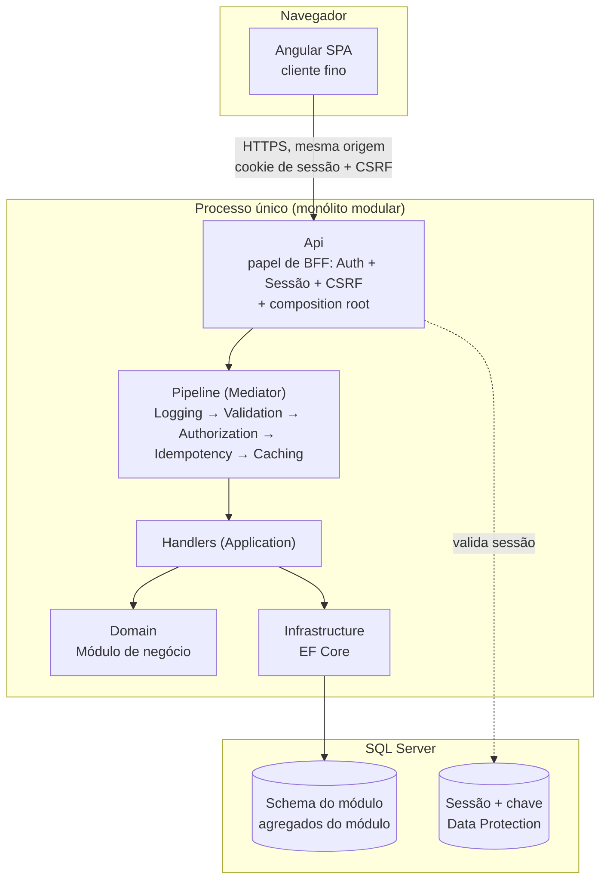
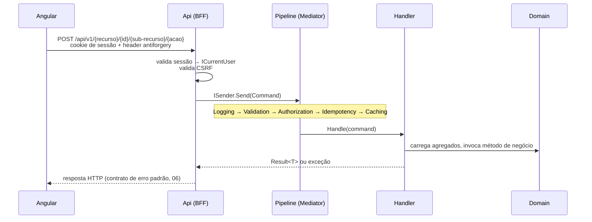
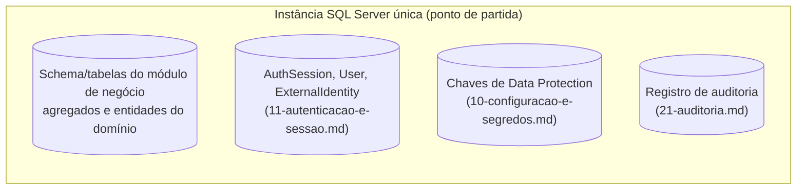

# Arquitetura do sistema

> Complementa o plano de implementação da funcionalidade que originou este documento. Este documento descreve a topologia completa do sistema (cliente Angular, BFF, camadas de API/serviços, banco de dados e o que fica compartilhado entre sistemas), decidida documento por documento de `arquitetura-de-referencia/`.

## Visão geral



Um único deployable (`Topologia A` de `17-bff-angular-e-comunicacao.md`), um único módulo de negócio, um único banco físico. Não há hoje sistema externo nem segundo módulo: as seções "Informação compartilhada entre sistemas" e "Entre módulos", abaixo, descrevem o padrão que entra em vigor se isso mudar, não algo já implementado.

## Cliente Angular

Conforme `17-bff-angular-e-comunicacao.md`:

- Não controla protocolo de autenticação, não guarda access/refresh token, não conhece endpoint de sistema externo.
- Não decide autorização: usa o que o backend devolve (`GET /api/me`: nome, papéis) só para esconder/mostrar elemento de tela. Autorização real é sempre no backend (`12-autorizacao-por-recurso.md`).
- `HttpClient` com `withCredentials`, sem interceptor de token, sem biblioteca OIDC no cliente.
- Um único interceptor HTTP centraliza o contrato de erro (`06-contrato-erro-http-idempotencia-e-concorrencia.md`): `401` → login, `403` → acesso negado explícito (papel genérico via `[Authorize(Roles=...)]` ou `AuthorizationDeniedException` dependente de dado, dois mecanismos distintos), `409` → idempotência/concorrência, `400` → mapeia campo a campo para o formulário. O corpo segue RFC 9457 (Problem Details), com `errors[]` sempre presente em 400, o que dá ao interceptor um único caminho de código para o mapeamento, sem precisar ramificar por tipo de exceção.
- Mesma origem em produção, sem CORS:

```text
/          Angular (SPA)
/auth/*    autenticação, login, logout, sessão
/api/*     funcionalidades de negócio do módulo
```

## BFF

Módulo único assumido; pelo mesmo critério de `01-estrutura-de-projetos-monolito-modular.md`, o BFF adota a Topologia A de `17-bff-angular-e-comunicacao.md`: o próprio projeto `Api` cumpre o papel de BFF (termina o fluxo de autenticação, guarda token só no servidor, expõe sessão via cookie, medeia CSRF) e é o composition root do backend, sem proxy reverso nem processo separado.

Justificativa de não forçar a Topologia B (BFF fisicamente separado): o backend inteiro é um único monólito modular, sem outro deployable e sem outro canal/cliente além deste Angular. Introduzir BFF separado adicionaria HTTP interno, autenticação entre serviços e mais um deployable sem ganho correspondente, exatamente o custo que `04-comunicacao-entre-modulos.md` evita para comunicação _dentro_ do monólito.

Um BFF por aplicação: não há BFF por módulo. Se um segundo módulo (ex.: um módulo extraído do módulo atual) aparecer futuramente, continua atrás do mesmo `Api`/BFF; só cria um segundo BFF se surgir um frontend genuinamente diferente desta aplicação.

### Onde a requisição cruza para dentro do backend



## Camadas de API/serviços

Ponto de partida de 2 projetos de produção para o módulo de negócio (`01`): o módulo (Domain+Application+Infrastructure fundidos, `internal`) + `{Modulo}.Contracts`, mais o projeto `Api` (composition root) e o(s) projeto(s) de teste.

| Camada | Responsabilidade | O que nunca faz |
| --- | --- | --- |
| **Api** | Controller fino: traduz requisição HTTP em `Command`/`Query` via `ISender`, e resultado em resposta HTTP. Papel de BFF (auth/sessão/CSRF). Composição na borda quando uma tela precisa de mais de um módulo (`04`); hoje sem cenário, só um módulo existe. | Regra de negócio, acesso a `DbContext`, autorização dependente de dado (isso é `Application`, `12`) |
| **Application** (módulo) | `Command`/`Query`/Handler (CQRS via Mediator, `03`), pipeline behaviors (`Validation`, `Authorization` via `IRequiresAuthorization`, `Idempotency`), tradução de exceção de domínio para `Result.Failure` | Regra de negócio do agregado, mapeamento EF Core, chamar `SaveChanges` (o commit é único, no `UnitOfWorkBehavior`, `25`) |
| **Domain** (módulo) | Agregados do módulo (ver plano de implementação da funcionalidade), invariante de negócio, eventos de domínio | Autorização (nunca mora no agregado, `12`), acesso a configuração, dependência de `HttpContext`/EF Core |
| **Infrastructure** (módulo) | `{Modulo}DbContext`, `IEntityTypeConfiguration`, repositórios, interceptor de auditoria (`21`) | Regra de negócio, exposição fora do módulo além de `Contracts` |
| **`{Modulo}.Contracts`** | Única superfície pública do módulo: `Command`/`Query`/DTO que outro módulo (se/quando existir) está autorizado a conhecer | Entidade de domínio, `DbContext`, handler |

Suíte de teste arquitetural (`NetArchTest`/`ArchUnitNET`) nasce junto com este primeiro módulo, não é adiada para quando houver um segundo (`01`). É um catálogo de fitness functions (`13`): fronteira de módulo (nada fora de `Contracts` é público; nenhum módulo futuro referencia o interior de outro), dependências acíclicas, direção de dependência (Ports & Adapters, `01`) e pureza do `Domain` (sem `DbContext`/`HttpContext`/`DateTime.Now`).

## Transação, escrita e leitura

Escrita (`25-transacao-e-unit-of-work.md`): cada `Command` tem uma transação e um commit único, no `UnitOfWorkBehavior` (envelope interno do handler), nunca no handler — o handler encena a escrita no repositório e retorna `Result`; o commit acontece só em caso de sucesso. Na mesma transação entram, atômicos, a mudança do agregado, o registro de auditoria (`21`, via interceptor) e — quando existirem — as linhas de Outbox e o registro de idempotência. Eventos de domínio são publicados in-process **depois** do commit. `RowVersion` (concorrência otimista, `06`) é traduzido de `DbUpdateConcurrencyException` para `ConcurrencyException` num único ponto, o `UnitOfWork` — nenhum handler nomeia a exceção do EF Core.

Leitura (`27-leitura-e-query-side.md`): toda `Query` lê com `AsNoTracking` e projeta direto para o DTO no banco (`.Select`), sem materializar o agregado; o escopo por linha (`14`, por `UserId`) vem antes da projeção. Rastreamento é exclusivo do lado de escrita (o `Command` carregando o agregado para mutar).

## Banco de dados



- Um único banco físico hoje, porque um único módulo: `04-comunicacao-entre-modulos.md` não tem cenário de aplicação ainda (nenhum outro módulo para isolar schema). Se um segundo módulo aparecer, a regra vale de qualquer forma: nenhum módulo referencia `DbSet`/schema de outro, só `Contracts`, mesmo com os dois módulos no mesmo banco físico (a fronteira é de ownership do dado, não de distância de rede).
- `RowVersion` (shadow property) nos agregados que sofrem concorrência otimista (`06`), complementar à `Idempotency-Key`; o conflito é traduzido para `ConcurrencyException` no `UnitOfWork` (ponto único de commit, `25`).
- Sessão (`AuthSession`, `User`, `ExternalIdentity`) e a chave de criptografia de cookie (Data Protection) reaproveitam o mesmo SQL Server que já guarda os dados do módulo de negócio, pelo critério de `10`: "o store concreto é escolha de infraestrutura; reaproveitar o que a aplicação já opera evita introduzir peça nova". Torna-se obrigatório (não só recomendado) a partir do momento em que existir mais de uma réplica do processo atrás de um load balancer.
- Registro de auditoria (`21`) gravado na mesma transação de negócio via interceptor de `SaveChangesAsync`, não em uma tabela/processo separado.
- Migração de schema segue o padrão expand/contract de `22-migracao-de-schema.md` quando uma mudança for breaking, compatível com rolling deploy de múltiplas réplicas. Ainda não é relevante com uma única réplica, mas o padrão já vale desde a primeira migration para não reaprender depois.

## Autenticação e sessão

```text
IdP (protocolo a definir) → token/assertion validada → identidade externa
  → identidade interna (UserId canônico) → sessão server-side → cookie HttpOnly/Secure
  → ClaimsPrincipal → ICurrentUser → Authorization → Application/Domain
```

- Backend é a fronteira de confiança, nunca o browser (`11`). Token nunca vive no Angular.
- Identidade interna (`UserId`) independente do protocolo do IdP, via `ExternalIdentity`: permite trocar o protocolo (ex.: de um IdP institucional para OIDC) sem alterar sessão nem aplicação.
- `SecurityVersion` em `User`/`AuthSession` para invalidar todas as sessões de um usuário sem localizar cada uma.
- Qual IdP concreto (institucional, Azure AD, OpenIddict próprio) não está decidido neste plano: é lacuna a levantar com o solicitante antes de `persistencia-e-integracao` desenhar `ExternalIdentity`, não coberta pela especificação clarificada original.

## Autorização por recurso

Duas camadas: papel genérico (`[Authorize(Roles=...)]`, nativo do framework, na Api) para regras do tipo "só um papel específico pode executar esta ação administrativa"; `IRequiresAuthorization`/`AuthorizationBehavior` (Application) para regras dependentes de dado, do tipo "só quem está associado a este recurso pode operar sobre ele"; filtro de dado (`14`) para regras do tipo "o usuário só enxerga o próprio registro".

## Informação compartilhada entre módulos (dentro do mesmo sistema)

Não aplicável hoje: um módulo só. Registrado aqui como o padrão que passa a valer no instante em que um segundo módulo for promovido (ver critério de promoção em `01`):

| Necessidade | Mecanismo (`04`) |
| --- | --- |
| Escrita que reage a evento de outro módulo | Dispatch pós-commit in-process: `INotificationHandler` no módulo que reage, despachando `Command` do `Contracts` do módulo dono via `ISender`; nunca injeção direta entre módulos |
| Leitura pontual de módulo alheio | `Query` do `Contracts` daquele módulo |
| Tela juntando poucos módulos, baixo volume | Composição na borda (classe própria da Api, nunca inline no controller; nunca regra de negócio na composição) |
| Composição repetida ou volume alto | Read model dedicado, projeção assíncrona via Outbox (`05`) |
| Consulta direta a mais de um schema | Exceção restrita, exige aprovação explícita em revisão de arquitetura |

## Informação compartilhada entre sistemas

Não aplicável hoje: especificação clarificada confirma "sistema novo, sem legado". Padrão que entraria em vigor se uma integração externa surgir (ex.: sistema externo dono de um dado mestre usado pelo módulo):

```text
{Modulo}.Application
  IServicoExterno              — interface, só o que o módulo precisa saber

Infrastructure.Legacy (ou equivalente)
  ServicoExternoAdapter         — implementação concreta, ACL (07)
  ServicoExternoHealthCheck
  ServicoExternoResilienceOptions (timeout + circuit breaker + retry seletivo)
```

- Todo adapter resiliente por padrão (`07`): num monólito, todos os módulos compartilham o mesmo pool de threads, então uma chamada externa lenta sem proteção degrada módulos não relacionados.
- Identidade técnica (BasicAuth/API key/client credentials) nunca é identidade do usuário; quando o sistema externo precisa saber quem originou a operação, o identificador vem de `ICurrentUser.UserId` gerado pelo próprio backend, nunca reaproveitado de header do usuário.
- Chamada síncrona (Api, com timeout curto e fallback explícito) quando o usuário precisa do dado na mesma resposta HTTP; via Outbox + worker (`05`) quando o efeito pode acontecer depois ou precisa de entrega garantida através de uma queda de processo.

## Configuração e segredos

- Só `Api` (composition root) e as classes `DependencyInjection` do módulo leem `IConfiguration` diretamente; `Domain` nunca lê configuração (`10`).
- Segredo de produção nunca em arquivo versionado nem embutido em imagem: secret store gerenciado (mecanismo concreto é escolha de infraestrutura de deploy, não de arquitetura de código).
- Configuração usada em mais de um lugar vira `IOptions<T>` com `.ValidateDataAnnotations().ValidateOnStart()`.

## Observabilidade

`LoggingBehavior` cobre log de Command/Query e tempo de execução; correlação via `HttpContext.TraceIdentifier` nativo. Sem gatilho para OpenTelemetry nesta topologia (critério sistêmico de `15`): um processo só, sem worker separado, sem integração síncrona externa. Decisão consciente de adiar, revisável se um desses dois aparecer.

## Lacunas e decisões pendentes desta visão de topologia

1. **Qual IdP concreto** autentica o usuário: não especificado; necessário antes de `persistencia-e-integracao` desenhar `ExternalIdentity`/`AuthSession` em detalhe.
2. **Quantas réplicas do processo** são esperadas em produção: determina se a chave de Data Protection e a sessão externalizada (`10`) são requisito desde o dia um ou podem ficar mais simples enquanto houver só uma réplica.
3. Pendências específicas de regra de negócio da funcionalidade que originou este documento continuam valendo e não são repetidas aqui.

## Referências

- `arquitetura-de-referencia/01-estrutura-de-projetos-monolito-modular.md`
- `arquitetura-de-referencia/02-dominio-hibrido.md`
- `arquitetura-de-referencia/03-commands-e-queries.md`
- `arquitetura-de-referencia/04-comunicacao-entre-modulos.md`
- `arquitetura-de-referencia/05-processamento-assincrono-e-eventos.md`
- `arquitetura-de-referencia/06-contrato-erro-http-idempotencia-e-concorrencia.md`
- `arquitetura-de-referencia/07-integracao-legado-acl.md`
- `arquitetura-de-referencia/09-convencoes-rest-api.md`
- `arquitetura-de-referencia/10-configuracao-e-segredos.md`
- `arquitetura-de-referencia/11-autenticacao-e-sessao.md`
- `arquitetura-de-referencia/12-autorizacao-por-recurso.md`
- `arquitetura-de-referencia/13-estrategia-de-testes.md`
- `arquitetura-de-referencia/14-filtro-de-dados.md`
- `arquitetura-de-referencia/15-observabilidade.md`
- `arquitetura-de-referencia/17-bff-angular-e-comunicacao.md`
- `arquitetura-de-referencia/21-auditoria.md`
- `arquitetura-de-referencia/22-migracao-de-schema.md`
- `arquitetura-de-referencia/25-transacao-e-unit-of-work.md`
- `arquitetura-de-referencia/27-leitura-e-query-side.md`
