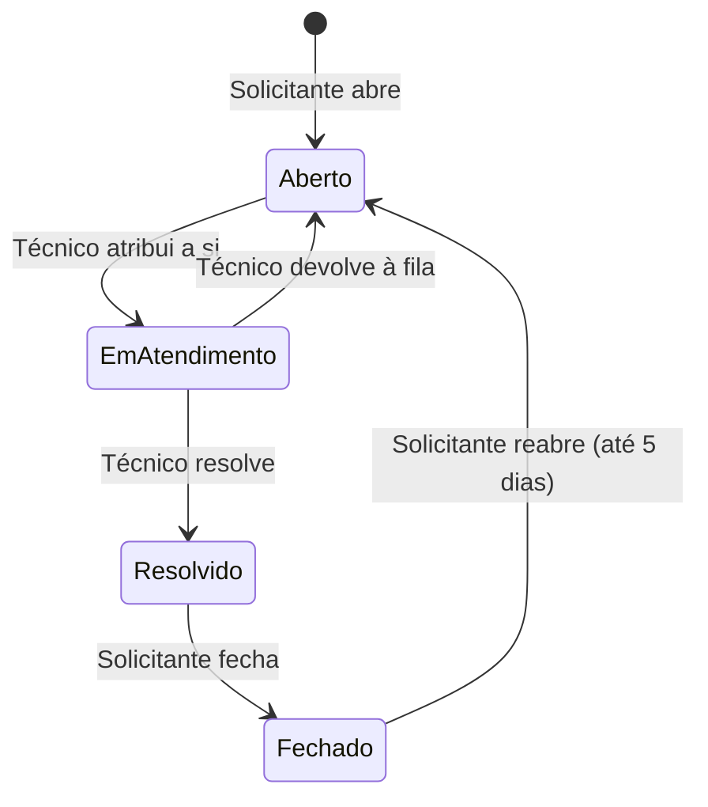

# Manual de utilização — Chamados de TI

Guia rápido para quem usa o sistema: como entrar, abrir e acompanhar chamados, e o que cada papel pode fazer.

## Papéis

| Papel | O que faz |
|---|---|
| **Solicitante** | Abre chamados, acompanha os próprios, fecha o que foi resolvido e reabre se o problema voltar |
| **Técnico** | Vê a fila da equipe, assume chamados, reclassifica a prioridade, resolve ou devolve à fila |
| **Supervisor** | Vê a fila da equipe e administra o Catálogo: categorias, SLAs, equipes e membros |

Uma pessoa pode ter mais de um papel. Técnico e supervisor só veem a fila se estiverem vinculados a uma equipe.

## Entrar e sair

1. Abra o endereço do sistema. Sem sessão, você vai direto para a página **Entrar**.
2. Informe login e senha e clique em **Entrar**. Você volta para a página que tinha pedido.
3. Para sair, clique em **Sair** no canto direito da barra superior.

A sessão dura até 8 horas. Depois disso, ou depois de uma troca de senha, o sistema pede login de novo.

Se errar a senha, a mensagem é sempre "Login ou senha inválidos.", sem dizer qual dos dois está errado. **Cinco erros seguidos bloqueiam o login por 15 minutos**, mesmo com a senha certa. Não há "esqueci minha senha": peça ao administrador (ver [Administração](#administração)).

## Ciclo de vida de um chamado



O **prazo SLA** é calculado pelo sistema a partir da categoria e da prioridade, contado desde a abertura.

## Solicitante

**Abrir um chamado.** Menu **Abrir chamado** → escolha a **Categoria** e a **Prioridade** (Baixa, Média, Alta, Crítica) → **Abrir chamado**. Você vai para o detalhe do chamado criado. Algumas categorias não atendem todas as prioridades; nesse caso aparece uma mensagem de erro no formulário e é preciso escolher outra prioridade.

**Acompanhar.** Menu **Meus chamados**: lista com prioridade, status, data de abertura, prazo SLA e técnico. Clique numa linha para ver o detalhe.

**Fechar.** Quando o técnico resolve, o chamado fica **Resolvido** e mostra a nota de resolução. Se estiver tudo certo, abra o detalhe e clique em **Fechar**.

**Reabrir.** Um chamado **Fechado** pode ser reaberto em até 5 dias corridos do fechamento, pelo botão **Reabrir** no detalhe. Ele volta para **Aberto**, sem técnico, e entra de novo na fila da equipe. Depois do prazo o botão avisa, e o sistema recusa.

## Técnico e supervisor

**Fila da equipe.** Menu **Fila da equipe**: os chamados das categorias atendidas pela sua equipe. Clique numa linha para abrir o detalhe.

No detalhe, só aparecem os botões das ações que você pode fazer naquele momento:

| Ação | Quando aparece | O que acontece |
|---|---|---|
| **Atribuir a mim** | Chamado **Aberto**, você é técnico | O chamado passa para **Em atendimento** com você como técnico |
| **Reclassificar** | Chamado **Aberto** ou **Em atendimento** | Escolha a nova prioridade; o prazo SLA é recalculado a partir da abertura original |
| **Resolver** | Chamado **Em atendimento** com você | Escreva a **nota de resolução** (obrigatória); o chamado fica **Resolvido** |
| **Devolver à fila** | Chamado **Em atendimento** com você | Volta para **Aberto**, sem técnico |

Toda ação pede confirmação. Enquanto ela é processada, os botões ficam desabilitados.

Se outra pessoa alterou o chamado depois que você o abriu (por exemplo, outro técnico assumiu antes), o sistema avisa e recarrega o chamado com os dados atuais, e você decide de novo.

**Categorias.** Menu **Categorias**: lista das categorias de serviço e da equipe responsável por cada uma.

## Mensagens comuns

| Mensagem | O que significa | O que fazer |
|---|---|---|
| "Acesso negado: você não tem permissão para esta ação." | Seu papel ou seu vínculo com o chamado não permite a ação | Confira se o chamado é seu ou da sua equipe |
| "Sua sessão foi renovada. Tente a ação de novo." | A proteção da sessão foi renovada (por exemplo, depois de muito tempo com a página aberta) | Repita a ação |
| "Este chamado foi alterado por outra pessoa desde que você o abriu…" | Alguém mudou o chamado antes de você | Confira os dados recarregados e decida de novo |
| "Conflito: a operação já está em andamento…" | A mesma ação já está sendo processada | Aguarde e confira o chamado; não repita |
| "Erro interno no servidor… (código: …)" | Falha inesperada | Informe o código ao suporte |

Se a página voltar para **Entrar** no meio do uso, a sessão expirou ou foi encerrada. Entre de novo: você volta para onde estava.

## Administração

Não há autocadastro. Quem tem acesso ao servidor da Api cria e mantém os usuários:

```bash
# cria o usuário e imprime a senha uma única vez
dotnet run --project src/Api -- criar-usuario <login> <Papel>[,<Papel>...]

# gera senha nova e encerra todas as sessões abertas do usuário
dotnet run --project src/Api -- redefinir-senha <login>
```

Papéis: `Solicitante`, `Tecnico`, `Supervisor`. O login não diferencia maiúsculas de minúsculas.

O nome que aparece nas telas (barra superior, técnico e solicitante nos chamados) é o nome de exibição do usuário. Defina ao criar (`criar-usuario maria Solicitante "Maria Silva"`) ou depois, com `definir-nome maria "Maria Silva"`. Sem nome, a tela mostra "Usuário" seguido do começo do id.

**Catálogo (Supervisor).** O supervisor vê dois menus a mais na barra superior:

- **Admin. equipes:** criar e renomear equipes, adicionar e remover membros. Só aparecem para adicionar os técnicos e supervisores que ainda não estão em nenhuma equipe: cada pessoa fica em no máximo uma. Para trocar alguém de equipe, remova da atual e adicione na nova.
- **Admin. categorias:** lista todas as categorias, inclusive as inativas. **Nova categoria** pede nome, equipe responsável e o SLA em horas de cada prioridade; deixar uma prioridade em branco significa que a categoria não a atende. **Editar** permite mudar nome, equipe e SLAs. **Inativar** tira a categoria da tela **Abrir chamado**, mas os chamados antigos continuam normalmente; uma categoria nunca é apagada e pode ser reativada.

Mudar a equipe de uma categoria não move os chamados já abertos: eles continuam com a equipe que tinham ao ser abertos.

Para começar com dados de exemplo, `scripts/seed/catalogo.sql` cria três equipes, sete categorias e seis membros.

**Em desenvolvimento**, a página **Entrar** tem também a seção "Entrar como (desenvolvimento)", para entrar com uma persona (um id e papéis) sem senha. Ela não existe em produção.

Para rodar o sistema localmente, veja `src/Api/README.md`.
