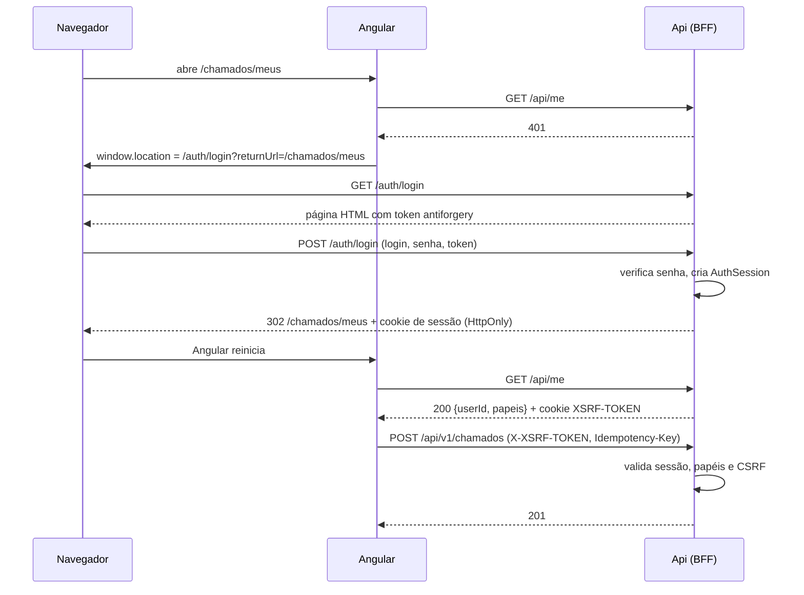

# Api

Projeto de borda do sistema de chamados. Ele cumpre três papéis no mesmo processo:

- **Composition root:** registra o `SharedKernel` e os módulos (`AddChamadosModule`, `AddCatalogoModule`) em `Program.cs`.
- **API de negócio:** controllers finos sob `/api/v1/*`, que traduzem HTTP em Command/Query (`ISender`) e `Result` em resposta HTTP (`arquitetura/09`, `arquitetura/06`).
- **BFF do Angular:** termina a autenticação, guarda a sessão no servidor, expõe a sessão por cookie e valida CSRF. É a Topologia A de `arquitetura/17`. O código fica em `Bff/` e `Controllers/Auth/`.

## Estrutura

```text
Program.cs                 composição, pipeline HTTP, /dev/login e comandos de administração
Controllers/
  Chamados/, Catalogo/     endpoints de negócio (/api/v1/...), incluindo a administração do
                           Catálogo (CategoriasDeServicoController, CadastroDeEquipesController)
  Auth/AuthController.cs   /auth/login, /auth/logout, /auth/csrf
  Auth/MeController.cs     GET /api/me
  Auth/UsuariosController  GET /api/v1/usuarios e /usuarios/nomes (diretório do BFF)
Infrastructure/            HttpErrors (fábrica de ProblemDetails), ProblemResult,
                           GlobalExceptionHandler, CompositeSender, HttpContextCurrentUser
Views/Auth/Login.cshtml    página /auth/login (view Razor do AuthController)
Bff/
  BffDependencyInjection   cookie, antiforgery, Data Protection, rate limiting, forwarded headers
  BffDbContext             User, AuthSession, ExternalIdentity, UsuarioPapeis,
                           CredenciaisLocais, chaves de Data Protection
  SessoesDeAutenticacao    cria, valida, revoga e expurga a sessão server-side
  ExpurgoDeSessoesService  BackgroundService que apaga sessões encerradas há mais que a retenção
  SessaoCookieEvents       valida a sessão a cada requisição; 401/403 em problem+json
                           (inclui PapeisDoServidorTransformation)
  LoginLocal               verificação de senha, bloqueio por tentativas
  CadastroDeUsuarios       criação de usuário, redefinição de senha, usuário de dev
  PaginaDeLoginModel       model da view de /auth/login
  Csrf                     cookie XSRF-TOKEN e filtro global de validação
  ComandosDeAdministracao  criar-usuario / redefinir-senha / definir-nome
  DiretorioDeUsuarios      nomes de exibição e lista de usuários (GET /api/v1/usuarios[/nomes])
```

## Como rodar

```bash
cd src/Api
dotnet run            # profile http, Development, http://localhost:5080
```

Em Development, a Api cria o schema dos três bancos SQLite na partida (`EnsureCreated`): `chamados.db`, `catalogo.db` e `bff.db`. Ainda não há migrations. Depois de mudar o modelo, apague os `.db` antes de subir.

Seed do Catálogo (equipes, categorias, SLAs e membros com ids fixos; depois também dá para manter tudo pela API de administração, papel `Supervisor`, `contratos-front.md` seção 7.12):

```bash
sqlite3 src/Api/catalogo.db < scripts/seed/catalogo.sql
```

Com o Angular: `cd client && npx ng serve`. O `proxy.conf.json` repassa `/api`, `/auth` e `/dev` para `http://localhost:5080`, então o navegador vê uma origem só.

Usuário do login local:

```bash
dotnet run --project src/Api -- criar-usuario maria Solicitante,Tecnico   # imprime a senha uma vez
dotnet run --project src/Api -- redefinir-senha maria                     # senha nova, derruba as sessões
dotnet run --project src/Api -- definir-nome maria "Maria Silva"          # nome de exibição
```

`criar-usuario` também aceita o nome como terceiro argumento: `criar-usuario maria Solicitante "Maria Silva"`.

Papéis válidos: `Solicitante`, `Tecnico`, `Supervisor`.

Roteiro completo por `curl`: `testes-manuais.md`. Contrato para o front: `contratos-front.md`.

## Configuração

| Seção | Chave | Padrão | Para quê |
| --- | --- | --- | --- |
| `Chamados`, `Catalogo`, `Bff` | `ConnectionString` | caminho do devcontainer | um SQLite por módulo, mais o do BFF |
| `Sessao` | `Duracao` | `08:00:00` | validade da sessão no servidor e do cookie |
| `Sessao` | `RetencaoAposEncerramento` | `30.00:00:00` | quanto tempo uma sessão expirada ou revogada fica no banco |
| `Sessao` | `IntervaloDoExpurgo` | `01:00:00` | intervalo do expurgo de sessões (`ExpurgoDeSessoesService`) |
| `LoginLocal` | `MaximoDeTentativas` | `5` | senhas erradas seguidas até bloquear |
| `LoginLocal` | `DuracaoDoBloqueio` | `00:15:00` | tempo de bloqueio do login |
| `LoginLocal` | `TentativasPorMinutoPorIp` | `10` | rate limiting de `POST /auth/login` |
| `ProxyReverso` | `RedesConfiaveis` | `[]` (só loopback) | CIDRs do proxy cujos `X-Forwarded-*` são aceitos |
| `Idempotencia` | `ReservationTimeout` | `00:05:00` | expiração de reserva de `Idempotency-Key` |

Todas as opções são validadas na partida (`ValidateOnStart`, `arquitetura/10`).

## Autenticação: como funciona



1. **Login.** O Angular não tem tela de login. Sem sessão, ele navega (página inteira) para `/auth/login?returnUrl=...`. A página é servida pela Api. Em caso de sucesso, a Api cria uma `AuthSession`, grava o cookie de sessão e redireciona para o `returnUrl`, que só é aceito se for local.
2. **Sessão.** O cookie (`Sessao` em Development, `__Host-Sessao` fora dele; `HttpOnly`, `SameSite=Lax`, `Secure` fora de Development) carrega só o `UserId` e o id da sessão. A cada requisição, `SessaoCookieEvents` confere no `bff.db` se a sessão existe, não foi revogada, não expirou e se o `SecurityVersion` ainda bate com o do usuário. Se algo falhar, o cookie é descartado e a resposta é 401.
3. **Papéis.** Ficam na tabela `UsuarioPapeis` e entram no `ClaimsPrincipal` a cada requisição (`PapeisDoServidorTransformation`), nunca no cookie. `ICurrentUser.IsInRole` e `[Authorize(Roles = ...)]` funcionam sem saber disso.
4. **`GET /api/me`.** Diz ao Angular quem está logado e com quais papéis, só para UX. A autorização real é sempre do backend (`arquitetura/12`).
5. **CSRF.** Toda action MVC mutável exige o header `X-XSRF-TOKEN` (ou o campo do formulário de login) igual ao token do cookie `XSRF-TOKEN`. Falha → 403 com `type` `/csrf-invalido`, antes de qualquer Command. O token é vinculado à identidade e é emitido por `/api/me` e `/auth/csrf`.
6. **Logout.** `POST /auth/logout` marca a sessão como revogada no banco e apaga o cookie. Um cookie copiado antes do logout não volta a valer.
7. **Expurgo.** De hora em hora, `ExpurgoDeSessoesService` apaga as sessões expiradas ou revogadas há mais de 30 dias, para a tabela não crescer sem limite. É um `DELETE` condicional, seguro com várias réplicas.

## Por que o login foi feito assim

**O login fica no backend, não no Angular.** `arquitetura/17` diz que o Angular não controla o protocolo de autenticação e não guarda token. Com um IdP de verdade, o fluxo é sempre uma navegação de página inteira para o backend, que redireciona para o IdP e recebe a resposta. Pondo a página de login no backend desde já, o Angular faz hoje exatamente o que fará com o IdP: `window.location = /auth/login?returnUrl=...`. Quando o IdP chegar, muda só o `GET /auth/login` (que passa a fazer `Challenge`), e o Angular não muda nada.

**O provedor é local e provisório.** O IdP ainda não foi escolhido (decisão D1 de `adaptacao-bff-angular.md`; lacuna 1 de `arquitetura-sistema.md`). Para não travar o sistema, o BFF autentica com login e senha próprios. A divergência de `arquitetura/11` está registrada na Nota de aplicação desse documento e só é aceitável porque preserva a cadeia de confiança:

- A credencial local é **mais um provedor externo**: cada uma tem uma `ExternalIdentity` com `Provider = "local"` apontando para o `UserId` interno. Sessão, cookie e `ICurrentUser` não sabem que o provedor é local, e o IdP vai entrar pelo mesmo caminho.
- Senha com `PasswordHasher<T>` (PBKDF2, com salt e versão no hash). O ASP.NET Core Identity inteiro não foi adotado: seria um modelo de usuário paralelo ao de `arquitetura/11`.
- Login inexistente, senha errada e conta bloqueada dão a mesma resposta, e o login inexistente também verifica um hash, para o tempo de resposta não revelar se o login existe.
- Bloqueio por login (5 erros → 15 min) contra ataque a uma conta, e rate limiting por IP (10/min) contra varredura. Um cobre o que o outro não cobre.
- Sem autocadastro: usuários só nascem pelo comando `criar-usuario`, fora da superfície HTTP.

**A sessão fica no servidor.** `arquitetura/11` pede estado autoritativo da sessão no servidor e permissão fora do cookie. Com isso é possível revogar uma sessão (logout, `redefinir-senha`, incremento de `SecurityVersion`) e tirar um papel com efeito na requisição seguinte. O custo é uma consulta por requisição, que o próprio documento aceita. As chaves de Data Protection, que cifram o cookie, ficam no mesmo banco (decisão D3), para o cookie valer entre reinícios e entre réplicas.

**A página de login é uma view Razor** (`Views/Auth/Login.cshtml`), renderizada pelo `AuthController`. A Api registra `AddControllersWithViews` só por causa dela; em troca, o encoding de todo valor dinâmico é automático e o HTML deixa de ser montado em C#. O POST continua no controller, então rate limiting, `returnUrl` validado, `Cache-Control: no-store` e o filtro de CSRF não mudaram. O encoder das views aceita todo o Unicode (`WebEncoderOptions`), para os acentos saírem legíveis.

**O filtro de CSRF é próprio.** O `AutoValidateAntiforgeryTokenAttribute` responde 400. `arquitetura/17` pede um 403 específico para CSRF, distinto do 403 de autorização. `ValidarCsrfFilter` faz a mesma validação e já responde o 403 certo.

**`/dev/login` existe só em Development** (decisão D5). Ele cria usuário e sessão reais, sem senha, a partir de um `userId` e papéis. Serve às personas da página de login (seção "Entrar como (desenvolvimento)", renderizada só em Development), ao `testes-manuais.md` e aos testes de integração. Fora de Development a rota nem é mapeada. `isSystemActor` não é aceito: o ator de sistema é do Worker (`arquitetura/26`), nunca de login HTTP.

**Produção fica atrás de um proxy reverso** (decisão D4). O proxy serve os estáticos do Angular e repassa `/api` e `/auth` na mesma origem, sem CORS. Por isso a Api usa `UseForwardedHeaders`: sem ele, toda requisição pareceria http (o cookie `Secure` e o antiforgery falhariam) e o rate limiting veria só o IP do proxy. A rede do proxy vai em `ProxyReverso:RedesConfiaveis`.

## Testes

```bash
dotnet test tests/Api.IntegrationTests
```

`ApiFactory` sobe a Api real com SQLite temporário, faz login por `/dev/login` e já configura o `X-XSRF-TOKEN`. `ApiFactoryDeProducao` sobe em Production para conferir cookies e a página de login sem personas. Os testes do BFF estão em `CsrfTests`, `SessaoTests`, `LoginLocalTests` e `CookieDeProducaoTests`.

## Pendências

- **IdP definitivo** (B9 de `adaptacao-bff-angular.md`): quando escolhido, entra como mais um provedor em `GET /auth/login`. O provedor local pode ficar só para contas de serviço ou sair.
- **Migrations:** nenhum `DbContext` tem migration. Fora de Development, o schema do BFF só é criado pelos comandos de administração, e a Data Protection precisa da tabela já na partida.
- **Nome de exibição** é opcional: usuário sem nome aparece como "Usuário xxxxxxxx" nas telas.

Histórico completo das decisões e do que foi implementado: `adaptacao-bff-angular.md`.
